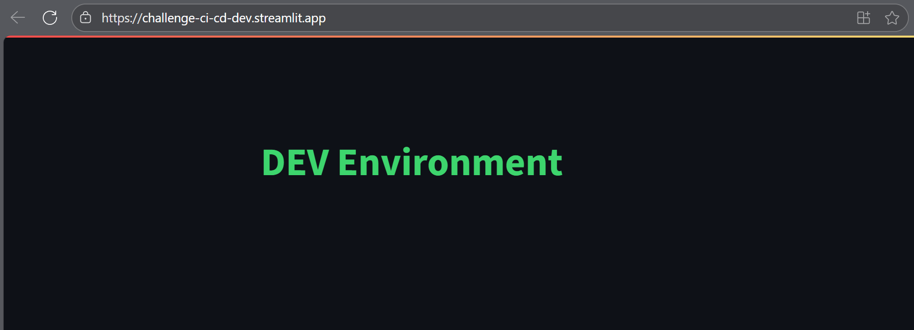

# 🚀 CI/CD with GitHub Actions

[](LICENSE) [](https://www.python.org/) [](https://docs.pytest.org/en/stable/) [](https://flake8.pycqa.org/) [](https://streamlit.io/) [](https://github.com/features/actions) [](https://github.com/features/actions)

This repository provides a hands-on example of implementing CI/CD pipelines using GitHub Actions. It demonstrates best practices for automated testing, environment-based deployments, and approval workflows, making it ideal for learning and showcasing DevOps skills.

## ✨ Features

- Automated CI pipeline runs lint and tests on every push request.
- Separate CD pipeline deploys to Dev, QA, and Production environments using GitHub Actions.
- Uses GitHub Environments for deployment targets and approval gates for Production.
- Streamlit app displays environment-specific styles and messages:
  - Development "DEV Environment" on green text
  - QA: "QA Environment" on yellow text
  - Production: "PRD Environment" on red text
- Branch-based deployment:
  - `dev` branch → Development environment
  - `qa` branch → QA environment
  - `main` branch → Production environment (with approval)
- Variable managed via GitHub for simulated deployment target.

## 📂 Project Structure

```
challenge-ci-cd-github/
├── LICENSE                  # License file for the project (MIT)
├── README.md                # Project documentation and instructions
├── requirements.txt         # Python dependencies for the app
├── requirements-test.txt    # Python dependencies for testing (pytest, flake8, etc.)
├── app/                     
│   └── main.py              # Streamlit application
├── tests/                   
│   └── test_app.py          # Tests for Streamlit app (run with pytest)
├── .github/                 
│   └── workflows/          
│       ├── ci.yml           # Continuous Integration workflow (lint and tests)
│       └── cd.yml           # Continuous Delivery workflow (deploy to Dev/QA/Prod)
└── .streamlit/              
    └── config.toml          # Streamlit app configuration
```

## ⚙️ GitHub Environment Setup

Each GitHub environment is configured with an `APP_URL` variable that points to its respective Streamlit Cloud app. This enables environment-specific deployments and ensures the application always references the correct URL for Dev, QA, and Production.

| GitHub Environment | APP_URL                                     |
|:-------------------|:--------------------------------------------|
| dev                | https://challenge-ci-cd-dev.streamlit.app   |
| qa                 | https://challenge-ci-cd-stage.streamlit.app |
| prod               | https://challenge-ci-cd.streamlit.app       |

## 🌐 Streamlit Environment Setup

To ensure the app displays the correct environment (DEV, QA, or PROD), you need to set the environment variable for Streamlit:

### Local Development
1. Create a file named `.streamlit/secrets.toml` in your project root (if it doesn't exist).
2. Add the following line, replacing `dev` with your desired environment:
    ```toml
    APP_ENV = "dev"
    ```
   - Use `dev`, `qa`, or `prod` as needed.
3. Run the app:
    ```bash
    streamlit run app/main.py
    ```

### Streamlit Cloud Deployment
- For each GitHub Environment (dev, qa, prod), set the `APP_ENV` variable in the Streamlit Cloud app settings:
    - Go to your app on Streamlit Cloud.
    - Open **Settings → Secrets**.
    - Add `APP_ENV` with the value matching the environment (`dev`, `qa`, or `prod`).
- This ensures the deployed app displays the correct environment styling and messaging.

## 🔄 Pipelines

This project uses two GitHub Actions workflows: **CI** and **CD**. Each pipeline is triggered based on branch activity to ensure code quality and controlled deployments.

### CI Pipeline
- **Runs on:**
    - Pushes to `dev` and `qa` branches
    - Pull requests targeting the `main` branch
- **Purpose:**  
    - Linting and testing code before merging or deploying

### CD Pipeline
- **Runs on:**
    - Pushes to `dev` branch → Deploys to Dev environment
    - Pushes to `qa` branch → Deploys to QA environment
    - Pushes to `main` branch → Deploys to Production (requires approval)
- **Purpose:**  
    - Automates deployments to environment-specific Streamlit Cloud apps

### Summary Table

| Pipeline | Trigger Branches          | Action                          |
|:---------|:--------------------------|:--------------------------------|
| CI       | `dev`, `qa`, PR to `main` | Lint & test                     |
| CD       | `dev`                     | Deploy to Dev                   |
| CD       | `qa`                      | Deploy to QA                    |
| CD       | `main`                    | Deploy to Prod (with approval)  |

This setup ensures that only tested and approved code reaches production, while development and QA environments receive updates automatically.

## 🖼️ Screenshots

### CI Pipeline Output


### CD Pipeline Output


### Streamlit App on Dev


### Streamlit App on QA


### Streamlit App on Prod


## 📋 Requirements

### App Requirements
```
streamlit==1.48.1
```

### Test & Lint Requirements
```
pytest==8.4.1
flake8==6.1.0
```

## 📜 License

This project is licensed under the [MIT License](LICENSE).

## 👤 Author

- [Alberto Pérez Dávila](https://github.com/albertopd)